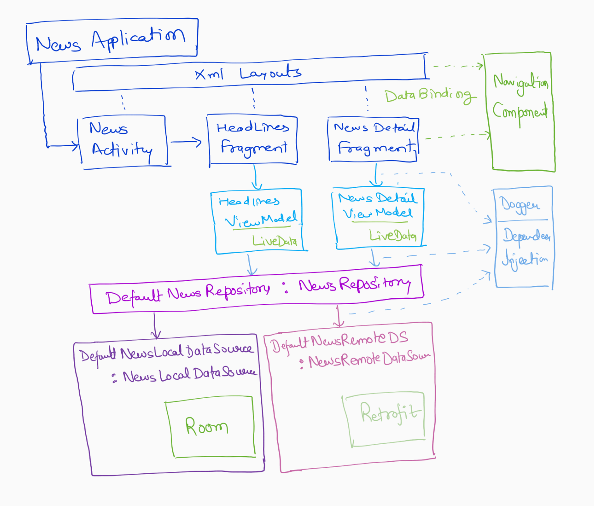

News - Byju's Android Assignment
================================

An application to show news headlines and details which uses [NewsAPI](https://newsapi.org/) to fetch the top headlines.

Architecture Design
-------------------

Libraries and tools
-------------------

This application us libraries and tools used to build Modern Android application, mainly part of Android Jetpack with Kotlin

- [Kotlin](https://kotlinlang.org/) first
- [Coroutines](https://kotlinlang.org/docs/reference/coroutines-overview.html)
- [Architecture components](https://developer.android.com/topic/libraries/architecture/)
- [Dagger 2](https://developer.android.com/training/dependency-injection) for dependency injection 🗡
- [Retrofit](https://square.github.io/retrofit/)
- [Coil](https://github.com/coil-kt/coil)
- Other [Android Jetpack](https://developer.android.com/jetpack) components

